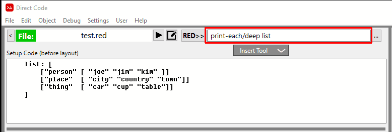

:numbered:
:toc:
= Development Tools

== Object Browser
A Red system object browser is available via the Menu Item:  *Object / Object Browser*.

This tool uses
https://gist.github.com/greggirwin/91dc1c3971998e0babeedba9f7e60bc5[ Gregg Irwin's Object Browser] - Thanks Gregg for a great tool.

== Red Command Line

=== Integrated Command Line
There is a Red command line integrated into Direct Code, as show below: 

This allows you to type in any Red command. Depending on their context some values may not be visible by the Red commands that you run here. To re-run a command you  have already entered just click on the 'RED>>' button. There is a handy "Mk Btn" (Make Button) button just to the right of the command line field. It will "Make a Button" and insert the button into the current layout where Red code will run when you click on it.

This is handy for testing, discoverying and experimenting with code that you need to understand.

=== Red Console

The Red Console that opens up when Direct Code start is also available to type
commands in any time you want. You won's always see the cursor in the console until you click into the console window.

== User Script / Red Code Snippet Testing

The *Red Code Snippet Testing Area* can be opened by selecting the Menu Item:
*User / Run User Script*. 

image:images/user-script.png[]

I have found that this is the most efficient way
for me to test and explore smaller segments of code without making changes to
the program that I am building. Because the 'User Script' is run as an "Attached" program you can monitor, change and play with almost every part of the currently running program.

The *User Script* program can be modified in any way you wish by selecting the Menu Item: *User / Edit User Script* 

== Red Online Search Tool

The xref:https://gist.github.com/mikeyaunish/4b842d0e54f52b3fd160668b0fa941b4[Red Online Search Tool] can be run by selecting the Menu Item: *Help / Red Online Search Tool*. 

This tool allows you to easily find documents and examples of any code that may exist on GitHub and the wider internet.

== System/View/Debug

You can turn on the the *system/view/debug* flag by selecting the Menu Item: *Debug / System / System/View/Debug = ON* or you can use the F11 key.

This allows you to see some of the internal workings of Red. Helpful to find out what keys are being pressed and what events are being generated.

== Show Named Objects
You can get a listing of all of the named objects in your program by selecting the Menu Item: *Object / Show Named Objects*

== Debug / Print functions

Two debugging print functions are supplied by the Direct Code 
environment. 

Both of these functions output can be turned on and off through the
Menu Item: 'Debug/Logging/Logging OFF' or 'Debug/Logging/Logging ON'
Or by pressing the F8 button.

- `lprint` which prints data to a log file called: 
   *direct-code.log*. This log file will be saved in the folder 
   that the program was run from. The log file is cleared 
   every time the Red script is restarted.
   
- `bprint` prints data to the screen as well as to 
    the log file.

== Restart Direct Code

You can restart the 'Direct Code' program by selecting the Menu Item: *File / Restart Direct Code* (or presss the F12 key). Depending on the status of your program the original Red Console may show this error which *you can ignore*:

----
*** Script Error: path event/face/type is not valid for none! type
*** Where: if
*** Near : if event/face/type = 'window [switch event ] 
*** Stack: context view do-events do-actor do-safe error? run ask ask do-events do-safe 
----

== Safe Start

The program 'direct-code-safe-start.red' has been supplied (in case of
emergencies) to allow you to restart the direct-code environment without any
interference from the program you are creating or any of the direct-code
settings.
