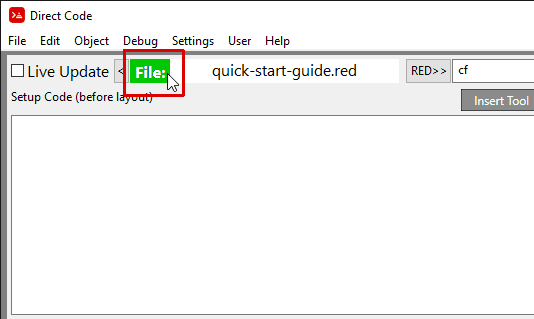

== External Text Editor

You can configure an external text editor via the Menu Item: *Settings / External
Editor* if it wasn't already configured when you started Direct Code initially. 

Direct Code comes preconfigured to support 4 different external text editors.
  
They are: UltraEdit, Notepad, Notepad++ and RedEditor. Visual Studio Code was attempted but doesn't allow command line options, so it doesn't work interactively with Direct Code.

Others text editors can be configured by editing the file:
/direct-code/settings/external-editor-settings.data 

The external editor can then be used as the primary code editor. You can open your red source code with the external editor, through the menu item: *File / Open with External Editor*.

You can also manually activate Auto Reload of the file through the Menu Item:
*File / Reload / Reload When Changed ON* or by clicking on the 'File:' label as shown below.

When the source file is being actively monitored for changes the color of the 'File:' label will turn green. This is only supported on Windows right now. If you wish to stop monitoring the source file select the menu item: *File / Reload / Reload When Changed OFF*

Whenever you save the file with your external text editor it will be automatically reloaded and run through the Red interpreter.

When you are using an external editor it is important to remember to save the file whenever you make changes before interacting with your program in the Direct Code environment because your file will be over written as soon as any changes are made in the Direct Code environment.

When modifying your code with an external editor the 'Live Update' check box isn't necessary
