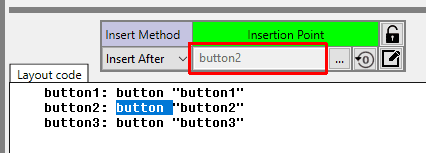

= Object Manipulation in Direct Code
:reproducible:
:numbered:
:toc:

== Overview
The insertion, duplication, deletion and moving of VID Objects within the Direct Code program are done in such a way as to mimic how physical bricks are laid down on a surface. 

Allowing the default layout scheme of Red to control how objects are arranged has proven to be the most efficient way to handle VID object layout. 

Although it is tempting to change the `offset` of VID objects to place them where they need to be, it is rarely needed, if you can master the use of `pad` and `space` within your VID layouts.

== Insertion Point Panel
image:images/insertion-point-panel.png[]

The *Insertion Point Panel* always shows you where and how any VID object activity will take place. If no object is selected (as shown above) then all objects `Insert After` the `Layout code` - meaning at the very end of the current layout script. 

=== Insert Method
The *Insert Method* can be changed by selecting the drop down as shown below:

The *Insertion Point* is changed when you select an object in one of the ways detailed below:

=== changing the Insertion Point
[options="header,footer"]
|=======================
|Changing the Insertion Point
|If ANY text is selected in the layout code (at least one character), then the object that this code belongs to will become the current *Insertion Point*.

|The VID Object Editor allows you to change the insertion point. 
See link:vid-object-editor.adoc#selecting_inserting_an_object[Set Insertion Point with with the VID Object Editor]
|Select an Object using the "..." button as shown below in red.

|Hover over a VID object and press the F3 key as shown below:

image:images/object-selection-f3.png[]

When the *Insertion Point* is set this way it is a *one shot* use. Which means once you do an insertion, duplication or move the *Insertion Point* is no longer in effect.
|Hover over a VID object and press the F4 key To *Lock-On* to this object as an *Insertion Point*. This means the the *Insertion Point* will remain in place over all actions until the *Insertion Point* is cleared (as described in the cell below) or changed.
|Clearing the *Insertion Point* by clicking on the "Zero Out" button as shown below:

|=======================

=== Editing the Insertion Point Object
You can edit any selected object directly from the *Insertion Point Panel* by clicking on the button shown below:

=== LOCKING ON to the Insertion Point
You can Lock ON to a VID object by clicking on the *lock icon() after the insertion point has been set, as shown below:

If you click the *lock icon* after the lock has been set ON then the *Insertion Point* is cleared.

== Shortcut Keys
All of the shorcut keys below are available when hovering over a valid VID object.
When you are dealing with a panel, tab-panel or group-box objects you need to activate or set the focus to the container 
object before hovering over the target object itself. This is because the GUI objects you see in the layout are often
re-interpreted as you add and remove objects. This is similar to how you have to click into a program's window before you 
can edit a spreadsheet cell. 

[options="header,footer"]
|=======================
|Shortcut Key   | Action
|F2             | Move object to Insertion Point
|F3             | Set object as Insertion Point
|F4             | Set object as Insertion Point and LOCK ON.
|ESC Key        | Clear Insertion Point
|Ctrl + Shift + 8 (Asterisk Key)          | Duplicate object to Insertion Point
|Ctrl + Shift + Minus Key   | Delete object
|Ctrl + Shift + Enter       | Add a VID `return` before this object
|Ctrl + Shift + Backspace   | Remove a VID `return` before this object
|Ctrl + Shift + Up Arrow    | Move object to Start of Boundary
|Ctrl + Shift + Down Arrow  | Move object to End of Boundary
|Ctrl + Shift + Right Arrow | Move object Ahead by 1
|Ctrl + Shift + Left Arrow  | Move object Back by 1
|=======================

There are a number of shortcut keys available to work with the VID Object Editor as well, you can find them link:vid-object-editor.adoc#vid_code_keycodes[here].

== Object Boundaries and Containers 
The reference to *Start of Boundary* and *End of Boundary* refers to the current boundary that the object is in. If an object is NOT inside of a *container* object (like a panel, tab-panel or group-box) then their boundary edge is the VID Layout script itself. If the object in question is within a container object, then the container is considered the boundary. 

==== Moving through Boundaries
An object can be moved past or through a container boundary once it is up against the edge of the boundary (either at the start or end of it).
By using the *Move object Ahead by 1* or *Move object Back by 1* then the object will move through that boundary into the next container. 
