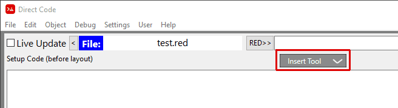
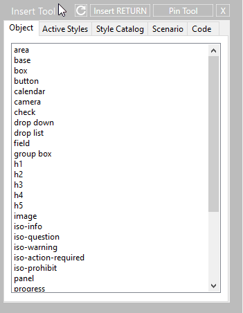

= Inserting VID Objects

To insert a VID Object into your program click on the  *Insert Tool* 

Then select which ever object you want in the *Object* tab

If the *Insert Tool* has not been pinned via the *Pin Tool* button on the *Insert Tool*, then the *Insert Tool* will close 

If *Auto Open VID Editor - ON* (See Settings Menu), then the *VID Object Editor* will open up.
If *Auto Open VID Editor - OFF* then the *VID Object Editor* will NOT open.

If you want to open up the *VID Object Editor* see: 
xref:vid-object-editor.adoc#activatingvoe[Activating the VID Object Editor] 