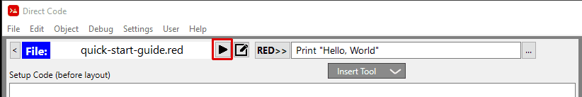

= Running the Interpreter and resulting programs
:reproducible:
:numbered:
:toc:

== Running the Interpreter
You can run the Red interpreter in one of 3 ways:

. Press the `run` button as shown outlined in red below.

. Press the Right Control Key runs the interpreter immediately. If the program runs succesfully it is saved as well. If the program generates an error it is NOT SAVED. This is to avoid saving faulty programs.
. Pressing the Control + "S" key (which saves and runs the program as well)

These unusual key combinations were specifically chosen so that they would not interfere with your programs' normal operations.

== Running the resulting program
Once you are ready to test and run the programs you have created with Direct Code, you have a few options: 

. Run Program Separately
.. You can launch your Red program in a separate window by selecting the following Menu Item: *File / Run Separately* or press the F9 key. The program is actually run through the command line so that there aren't any residual dependencies from the Direct Code program interfering with your program. All Red programs created with Direct Code are stand alone Red programs. If you use some of the special functions built into Direct Code you may need to include them in your program for stand alone use. See link:setup-code-edit-area.adoc[Setup Code Edit Area] for details on how to do this.

. Run Program Attached

.. You can launch you Red program in an *attached* manner by selecting the menu item: *File / Do File (Attached)* or press the F6 key. This is an intriguing development that opens up a whole new world of program development via Direct Code. When you run your program like this, (as the "Run User Script" program is) you then have full access to all of the inner workings of Direct Code and of your own program as well. This allows you to change and monitoring the program you are building with another program. See link:direct-code-internals.adoc[Direct Code Internals] for more information.

After running your programming using F6 you now have two versions of your program running. There will be possible object naming conflicts between the two running programs. To get Direct Code to work properly again, close the second program and re-interpret your program.