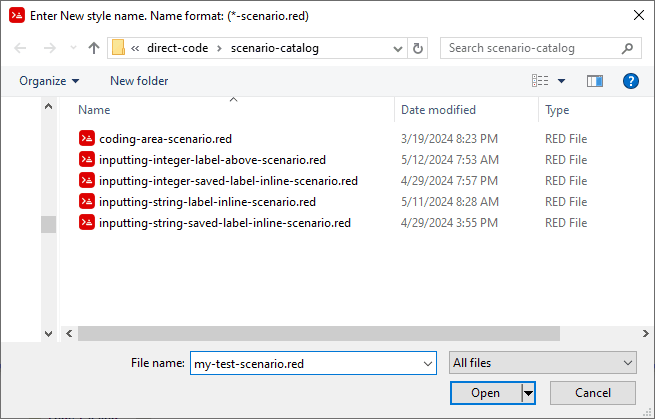

:numbered:
:toc:

= Direct Code VID Scenarios

== Abstract
A *scenario* is a group of VID objects. The group of objects usually have an overall action they are trying to accomplish, hence the scenario names start with a verb. 

The invention of a VID *scenario* is a relatively new one in the Direct Code environment and will require ongoing research and development. See: xref:future-developments.adoc#_scenarios[Future Developments]

== Inserting a Scenario

To insert a VID Scenario into your program click on the *Insert Tool* 

image:images/insert-tool2.png[]

Under the *Scenario* tab select  *inputting-string-label-inline*.

You will be prompted with a *setup-style* requester

In this example "Address:" is used for the field label and "address-field" has been used for the Field name. 

Which will result in the following GUI layout

== Creating a Scenario

A Scenario is made up of a group of styles that usually contain `setup-style` code blocks but the existence of a `setup-style` code block isn't mandatory.

Once a scenario is created it can be reused for creating new layouts. The scenario we are creating now is a *mock up* of what we want the scenario to do for us.

To create a VID Scenario into your program click on the *Insert Tool* 

image:images/insert-tool2.png[]

Select the *Scenario* tab and then click on the *New Scenario* button

=== Scenario Naming
Specify the *scenario* filename when prompted. Ensure the file name ends with "-scenario.red" this indicates to Direct Code that this is a special *scenario* file. When creating or editing a scenario, Direct Code will include all `setup-style` code blocks contained in a style, so that the scenario is complete and can be modified without affecting the underlying styles. Under normal layout editing the `setup-style` code blocks are not included.

In the example below we are using the filename: "my-test-scenario.red"

Now you can add any styles that you want through the *Insert Tool / Style Catalog*. In this example we will insert a *label-inline* style.

Click on the *Insert Tool*

image:images/insert-tool2.png[]

Then select the *label-inline* style

Then enter the text label you want for this *mock* object.

To complete our scenario lets add a *field-root* style to our layout.

Name the field: *first-name-field*

We now have the bones of our scenario. We can change the layout and `setup-style` blocks to more accurately represent our new *scenario*.

Fine tune the layout by manually add the following code (outlined in red).

Manually change the `setup-style` for the *label-inline* style as shown below:

Manually change the `setup-style` for the *field-root* style as shown below:

These are simple changes to customize the *scenario*. This just scratched the surface of what a scenario can do. For more detailed information about how the `setup-style` code block works within a scenario see: 
link:setup-style.adoc[setup-style Documentation]

You can now create a new VID layout using your newly created scenario.
See: xref:#_inserting_a_scenario[Inserting a scenario]

