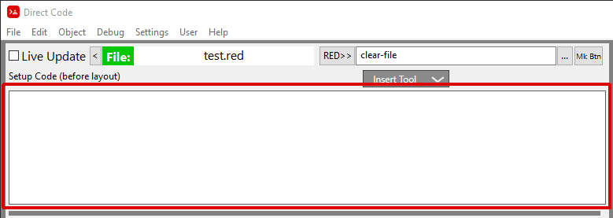
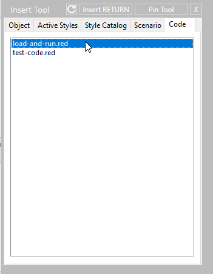

== Setup Code Editor
The Setup Code editing area of Direct Code utilizes a standard Red area object to modify the source code that will run *before* the Layout code. Show below outlined in red:

Segments of code can be inserted into the Setup Code Editor by opening the *Insert Tool / Code tab* and selecting one of the Red files contained in the Code listing. 

anchor:anchor-load-and-run[]
Below shows how to insert the `load-and-run` function neccesary to allow your programs to traverse one to another (outside of the Direct Code development environment)

You can place any of your own Red code in the *direct-code/code-catalog/* folder and it will display in the *Code* tab of the *Insert Tool*.
