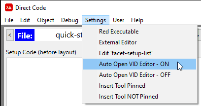
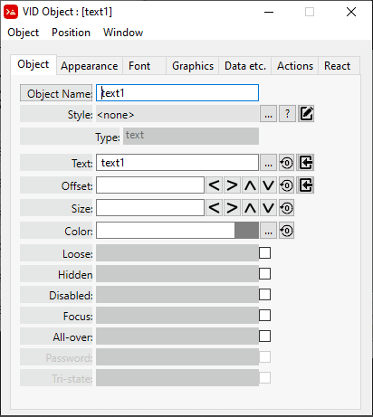

= setup-style Code Block
:reproducible:
:numbered:
:toc:

== Abstract

*setup-style* is a block of code that controls how a VID Object Style will be created when the style is inserted into a layout. The primary purpose is to customize facets of a VID Object Style as it is being inserted. 

== Manual Creation of a *setup-style* code block

Let's take a simple VID styled text object, like this:
----
style label: text "sample text"
----
and add a simple *setup-style* block to it
----
style text-root: text "sample text" extra [
    setup-style: [
        [
            input [
                prompt "Text string" 
                detail "The text that will display on the object created."
            ] 
            action [
                alter-facet/value 'text input-value
            ]
        ]
    ]
]
----
The *setup-style* is simply a code block that can be added to the *extra* portion of any style. The *setup-style* can be added and edited manually but there are tools within Direct Code that can do this for you.

Below discribes how this is done in Direct Code

== Defining a *setup-style* code block within Direct Code
Before following these instructions go to the Settings Menu and ensure *Auto Open VID Editor* = ON

Insert a plain VID Object by clicking on the *Insert Tool* button. 
image:images/insert-tool2.png[]

Select the *text* object 

image:images/insert-text-object.png[]

You should now see the VID Object Editor. (If you have *Auto Open VID Editor = ON*, as described in the first step). If you do not see the VID Object Editor, you can open it by hovering over the 'text' object in question and either pressing the middle mouse button or Alt + Tilde.

Convert the text Object to a Style by selecting the menu *Object/Convert to Style*

image:images/convert-to-style.png[]

Enter the name of style you want to create. In this example "my-text" 

The original VID Object Editor will close and reopen to display your object as a *styled* object. Everything that displays in green indicates a facet controlled by a Style. 
Open the *VID Style Editor* for the style just created by clicking on the *Edit Style Icon* outlined in red below:

Once the VID Style Editor appears you can create a *setup-style* code block for the Style by selecting the menu item: *Style / Create 'setup-style'*

Every facet is available to select here, but select the *text* facet and click on "OK", just to see how it works.

image:images/select-text.png[]

The Layout code for the *my-text* style should now look like this
----
	style my-text: text "text1" extra [
	    setup-style: [
	        [
	            input [
	                prompt "Object text" 
	                detail "Text displayed on the object created."
	            ] 
	            action [
	                alter-facet/value 'text input-value
	            ]
	        ]
	    ]
	]
	text11: my-text
----

.You can now test the *setup-style* you just created in one of three ways:
- 1.) Re-run the *setup-style* on an existing Object

and you will be prompted for the *setup-style* information.

- 2.) Use the *Insert Tool* to insert the *my-text* style in the "Active Styles" tab.

Enter the "Object Text" that you want to for your *my-text* style

You will now have a *my-text* object inserted into the layout with the text you supplied. The source code will look like this:
----
my-text1: my-text "Hello, World"
----

- 3.) Hover your mouse cursor over any object that has a *setup-style* and press the F2 key then you will be prompted for the *setup-style* information.

== setup-style Process Flow

`setup-style` is a block of code that is included in the `extra` block of a style. A simple `setup-style` usually consists of two blocks defined by the keywords `input` and `action`. These blocks define how the `setup-style` will function. Below is a diagram describing what happens when the style `label-inline` is inserted. 

== setup-style data keywords

=== When is the setup-style code block run?
The *setup-style* code block will be run, following these priorities:

- 1.) If the Style being inserted is selected from one of the *Active Styles* the setup-style code block will run from the current file (if it exists). If the setup-style code block doesn't exist in the local file but does exist in the sytle catalog then the setup-style code block in the style catalog will be run.
- 2.) If the Style being inserted is in the Style Catalog, the setup-style code block in the Style Catalog will run (if it exists).
