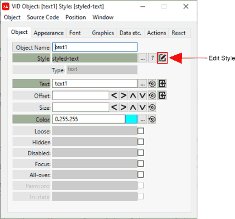

:numbered:
:toc:
= Style Object Editor

== Overview

The *Style Object Editor* works exactly as the xref:vid-object-editor.adoc[VID Object Editor] works. Except that it controls facets for all instances that use the style. By leaving *Style Object Editor* and the *VID Object Editor* open at the same time you can see where facet values are set. See: xref:vid-object-editor.adoc#styled-facets[VID Object Editor and Styled Facets]

== Opening the Style Object Editor

You can open the *Style Object Editor* one of four ways:

. Through the VID Object Editor by clicking on the *Edit Style* button as highlighted below:
 

. Holding the SHIFT key down and pressing the middle mouse button while hovering over a GUI Object

. Pressing the Control + Shift + backtick keys while hovering over a GUI Object

. Highlighting a portion of a style code in the VID Code Editor and pressing the Control + backtick keys

== Styled Object Behaviour

When dealing with cascading VID styles, the default Red behavior is that any *action* (like `on-click` and `on-change` etc.) that a parent has will be completely overridden by a child if the child has the same action defined.
       
When using Direct Code, however, you are able to see the existing style action and append and/or change the style action as the overriding behavior. This allows you to use the style as a starting template and build upon it without having to rewrite the original style behavior. 
  
When inserting a cascading style (styles containing parents and children) if there is a `setup-style` block contained anywhere in the family tree the youngest `setup-style` block or `setup-style` closest to the style being inserted is used.
  
When dealing with a cascading style the youngest object takes precedence. IE. If you insert a parent/child/grandchild object you can't really run the parent or  grandparent style objects separately. This needs to be considered when designing cascading styles.

Let's say you create a custom field style like this : _parent-field_ and a _child-field_ .
The _child field_ is the usable portion of this style and will be the one listed
in the style catalog. The _parent-field_ is not accessible in any way other than through the _child-field_. 