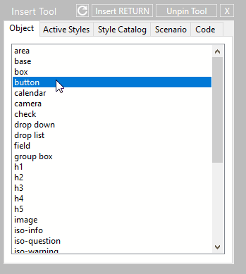
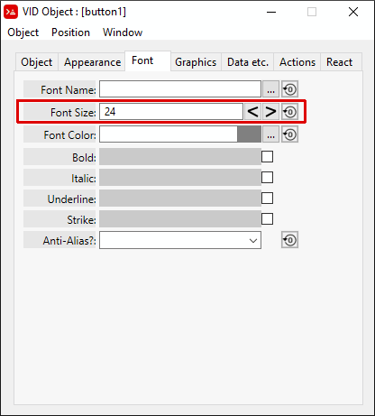
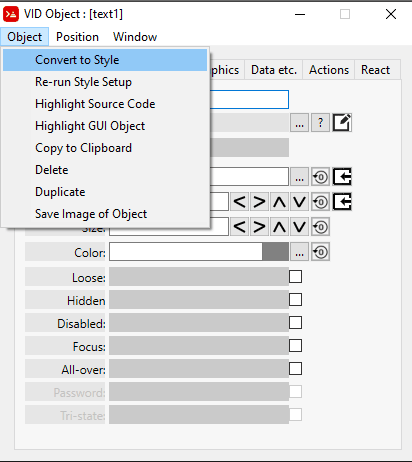
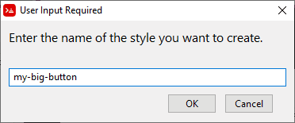
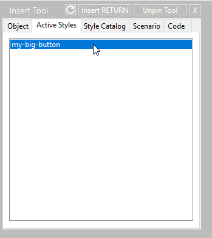
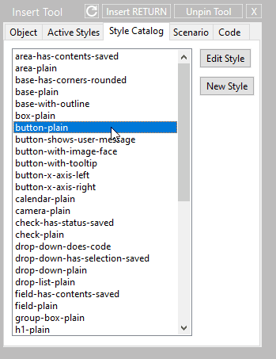
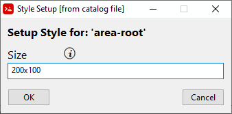

:numbered:
:toc:

= VID Style

== Abstract
A VID *Style* is useful if you plan to re-use a format or behaviour of a particular VID object. 

== Creating a VID Style
Let's say we want to repeatedly use the formatting of a button with a large font.
First we start by creating a new plain VID object.

Click on the *Insert Tool*

image:images/insert-tool2.png[]

From the *Insert Tool* window, select the *Object* tab and click on *button*

From the VID Object Editor window select the *font* tab and change the *Font Size* to 24

You should now have a button with a large font.

From the VID Object Editor Window select the menu item *Object / Convert to Style*

You will be prompted to name your new style

You now have a style defined in your program, which will now display as one of the *Active Styles* in the *Insert Tool* window.

=== Creating a setup-style code block

To customize how a style gets inserted see: link:setup-style.adoc[ setup-style Code Block]

== Inserting a VID Style

To insert a VID Style into your program click on the *Insert Tool* 

image:images/insert-tool2.png[]

=== Inserting from an Active Style or Style Catalog

You can insert a Style one of two ways:

 - 1.) If there are any existing styles in your Red program then you can select its' name under the  *Active Style* tab

If the style you have inserted contains a *setup-style* code block you may see a requester asking you to input some facet information. See link:setup-style.adoc[ `setup-style` Documentation]

- 2.) From the *Insert Tool* select the *Style Catalog* tab, then select *area-root*

In this example the *area-root* style will prompt you for a size like this:

A *setup-style* code block is part of the *area-root* which is what creates the requester for the area size (as shown above).
For more information about the `setup-style` code block see: link:setup-style.adoc[`setup-style` Documentation]

