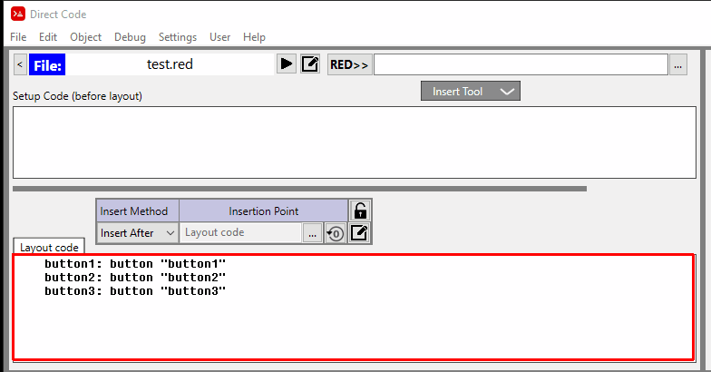

:numbered:
:toc:

= VID Code Editor

== Layout Code Area
The Layout Editor is show below (outlined in red):

 

The Code Editor is a simple Red text area. It isn't designed to do any heavy code editing, because you can use an External Code Editor See xref:external-editor.adoc[External Editor] for more details.

== Special Features Available

*Selecting Text*

- If ANY text is selected (at least one character), then this selected code will become the current *Insertion Point* and the insertion of any object will be relative to this object.

image:images/insertion-point-object-selected.png[]

See: xref:vid-object-editor.adoc#insertionpoint[Object Insertion Location]

- If any text is selected in the VID Code Editor and you press the Control + backtick keys the VID Object Editor or Style Object Editor will open up for the given object. 

