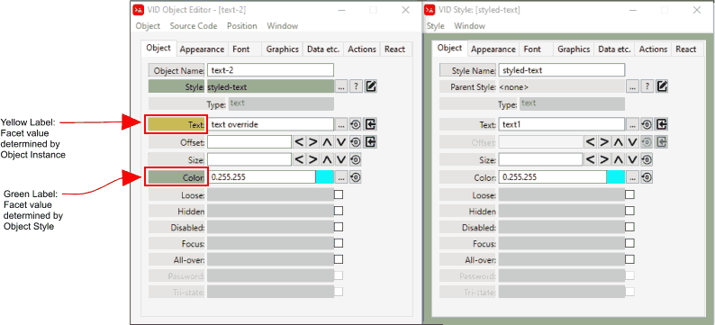

= VID Object Editor
:reproducible:
:listing-caption: Listing
:toc:

== Quick Start Example
Before following these instructions go to the Settings Menu and click *Auto Open VID Editor = ON*

image:images/auto-open-voe-on.png[]

Create a new file by selecting the menu item File/New

image:images/new-file-menu.png[]

Create the file wherever is convenient for you. The *direct-code/scratch* folder is available to use for any testing or experiments. 

Insert a plain VID Object by clicking on the *Insert Tool* button as outlined in red below. 
image:images/insert-tool2.png[]

Under the *object* tab select the *text* object 

You should now see the VID Object Editor. (If you have *Auto Open VID Editor = ON*, as described in the first step)

image:images/vid-object-editor.png[]

You can now see and edit any *facets* of this object that you want. As you modify the *facet* values in the VID Object Editor the code changes accordingly in the "Layout Code" text editor.

== Styled Facets
[#styled-facets]

In the situation where the VID Object Editor is displaying an object that is an instance of a *styled object*, you will see facets that are labelled green. These facet values are controlled by the underlying style. 

Here is an example of *text-2* object that has a parent style of *styled-text*.
Clicking on the *Edit Style* button (icon to the far right of the *Style* field)
will display the *Style Object Editor* for the style indicated.

image:images/voe-and-soe.png[]

If you decide to over ride the facet value supplied by the *style* the field label for that facet will turn yellow, so that you can easily see if the main object or an underlying style is controlling a given facet.

== Selecting Code for an Object 
The first facet in any object is the *Object Name*. You will notice that the *Object Name* field label is also a button. 

image:images/voe-object-name-facet.png[]

When you click on the *Object Name* label the source code for the object is highlighted (selected in Red parlance) in the "Layout Code" editor. 

image:images/layout-object-highlighted.png[]

If you are using an link:external-editor.adoc[external text editor], likewise the source code for the object will be highlighted in your external text editor.

=== Placement of Inserted Objects
[#insert_location]
Clicking on the *Object Name* doesn't just locate the VID code in your source but is also used as an *object cursor*. 

Inserting or duplicating any object into the layout, by default, will be added to the very end of the Layout Code. (Yes, technically, this is actually an append). _Insert_ in this context is used in a generic way.

If any text in the layout code is selected (either manually or via the VID Object Editor) then the new object will be inserted immediately before the selected text (taking into account the boundaries of the selected object)

If *selected* code is in the *style* section of the program then any object inserted will be placed immediately after the entire style section.   
 

See link:style-object-editor.adoc[Style Object Editor] to find out how the Style Object Editor works.

[#activatingvoe]
== Opening the VID Object Editor

The VID Object Editor can be opened from both the running GUI program and from the VID source code by utilizing one of the following techniques:

. From the GUI program (VID Object Editor with normal window placement)
.. Press the middle mouse button on the GUI object in question
.. Press the Control + '~' key when your mouse is over the GUI object in question
        
. From the GUI program (VID Object Editor placed at the left edge of the screen)
.. Hold down the left control key then press the middle mouse button on the GUI object in question
.. Press the Control + '1' key when your mouse is over the GUI object in question

. From the VID Code Editor,  which is the bottom left panel labelled: "Layout code in VID dialect" (VID Object Editor with normal window placement)
.. Select at least one character of source code within the object in question, then press the middle mouse button
.. Or select at least on character of source code within the object in question, then press the Control + '~' keys. (Control + Tilde)
           
. From the VID Code Editor (VID Object Editor placed at the left edge of the screen)
.. select at least one character of source code within the object in question, then hold down the left Control key and press the middle mouse  button
.. Or select at least one character of source code within the object in question then press the Control + '1' keys. 

Values that require pairs like the size and offset or a single integer value 
like the font size have a unique modifier tool which are the arrows that 
display right after the data entry field. Clicking on the arrows will change 
the value by one value (or pixel). Using the mouse scroll wheel will change 
the value by larger amounts and by clicking and dragging you can change the 
values freehand depending on where the mouse is.

There are also two fields that have unusual data entry options. That is the 
'Text' and 'Offset' fields. To the right of the field you will see an arrow 
pointing towards an empty box, this is to represent an "Import" action. 
If you change the 'Text' that a 'field' or 'area' contains by modifying 
it in the running GUI program itself,you can then press the import button 
and the source code will be updated to reflect that new value.

You can do the same with the 'offset' field. Make any object 'loose'
and drag it to where you want it, then press the import button to write it's 
new location to the source code.

== Limitations
Currently the VID Object Editor and the Style Object Editor do not recognize variable or color names. This limitation can be overcome by changing the code manually through the code editor.