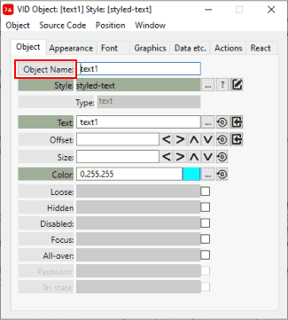

= VID Object Editor
:reproducible:
:listing-caption: Listing
:toc:

== Quick Start Example
Before following these instructions go to the Settings Menu and click *Auto Open VID Editor = ON*

image:images/auto-open-voe-on.png[]

Create a new file by selecting the menu item File/New

Create the file wherever is convenient for you. The *direct-code/scratch* folder is available to use for any testing or experiments. 

Insert a plain VID Object by clicking on the *Insert Tool* button as outlined in red below. 
image:images/insert-tool2.png[]

Under the *object* tab select the *text* object 

image:images/insert-text-object.png[]

You should now see the VID Object Editor, as shown below. (If you have *Auto Open VID Editor = ON*, as described in the first step)

image:images/vid-object-editor.png[]

You can now see and edit any *facets* of this object that you want. As you modify the *facet* values in the VID Object Editor the code changes accordingly in the "Layout Code" text editor and the Graphical object changes as well.

== Styled Facets
[#styled-facets]

In the situation where the VID Object Editor is displaying an object that is an instance of a *styled object*, you will see facets that are labelled green. These facet values are controlled by the underlying style.

Here is an example of *text-2* object that has a parent style of *styled-text*.
Clicking on the *Edit Style* button (icon to the far right of the *Style* field)
will display the *Style Object Editor* for the style indicated.

If you decide to override the facet value supplied by the *style* the field label for that facet will turn yellow. The yellow color shows that if the object facet is set by the *instance*, the green color shows that the facet value is set by the *style*.)

image:images/voe-and-soe-yellow.png[]

[#selecting_inserting_an_object]
== Selecting an Object / Set Insertion Point 

Selecting an Object is used as a reference point for any Object Insertions, Duplication or Moving. In essence this is used as an *object cursor* or `Insertion Point`.

The first facet in any object is the *Object Name*. You will notice that the *Object Name* field label is also a button. 

When you click on the *Object Name* label (as shown above) the resulting actions are shown in the table below:
[options="header,footer"]
|=======================
|Mouse Action (on label)   |Result
|Single Click              |If NO Object is selected then this Object will will be set as the `Insertion Point` and it's source code will be highlighted. If an Object is already selected then the that Object will be de-selected
|Double Click              |Object is set as the `Insertion Point` and the `Insertion Point` is LOCKED-ON. Which means this `Insertion Point` will persist until it is unlocked or cleared. 
|=======================

Here is what the VID Code Editor looks like when an object is selected:

If you are using an link:external-editor.adoc[external text editor], the editor will be positioned at the objects' source code as well.

[#insertionpoint]
== Insertion Point and placement of objects
Clicking on the *Object Name* doesn't just locate the VID code in your source but is also used as an *object cursor*. 

The *Insertion Point* panel displays where and how objects are inserted.

By default (as show above) all new objects `Insert After` the current `Layout code`

Inserting, duplicating or moving any object happens in relation to the *Insertion Point*

If any text in the layout code is selected (either manually throught the code editor or via the VID Object Editor) then that object will become the *Insertion Point* . As long as at least one character within the VID Code Editor is selected then that object is considered *Insert Point*.

If any source code in the *style* section of program is selected then any objects inserted will be placed immediately after the *style* section.   
 

See link:style-object-editor.adoc[Style Object Editor] to find out how the Style Object Editor works.

[#activatingvoe]
== Opening the VID Object Editor

The VID Object Editor can be opened by clicking directly on a GUI object (with the appropriate button) or from the VID source code editor (when you select at least on character)

[#vid_code_keycodes]
[options="header,footer"]
|=======================
|Key Combination            |Mouse Location           |Result
|Middle Mouse Button        |GUI Object     |Open VID Object Editor for Object under mouse
|CTRL + Middle Mouse Button    |GUI Object     |Open VID Object Editor for Object (positioned far left on screen)
|SHIFT + Middle Mouse Button   |GUI Object     |Open VID Object Editor for the Object STYLE 
|Alt + Right Mouse Button   |GUI Object     |Open VID Object Editor for Object 
|CTRL + '1'    |GUI Object     |Open VID Object Editor for selected Object (positioned far left on screen)
|   |     |
|CTRL + "~" (tilde)  |VID Code Editor    |Open VID Object Editor for selected Object or Style
|Middle Mouse Button        |VID Code Editor      |Open VID Object Editor for selected Object or Style
|CTRL + Middle Mouse Button    |VID Code Editor     |Open VID Object Editor for selected Object (positioned far left on screen)
|CTRL + '1'    |VID Code Editor     |Open VID Object Editor for selected Object (positioned far left on screen)
|=======================

       

When entered values in VID Object Editor that require pairs like the size and offset or a single integer value 
like the font size have *spin buttons* that appear to the right of the data entry fields.

 
[options="header,footer"]
|=======================
|Spin Button Action   |Result
|Clicking on a button   |Changes the value by 1 unit
|Mouse Scroll Wheel     |Changes the value by 5 units
|Click and Drag Mouse   |Changes the value depending on direction and amount of drag
|=======================

The *Import* buttons will import the appropriate values from the live running object.

You can type into any object that accepts text input (like field and area), then if you want that text string to become the permanent text value press the *import* button. This needs to be done immediately before the Red Code interpreter is run.

You can do the same with the *offset* facet by making any object 'loose'
and drag it to where you want it, then press the import button to write it's 
new location to the source code.

== Limitations
Currently the VID Object Editor and the Style Object Editor do not recognize variable or color names. This limitation can be overcome by changing the code manually through the code editor. Some facets such as *para* and *font* that are described in a block are not processed by Direct Code. The simpler form of these facets are used for the sake of clarity and simplicity.