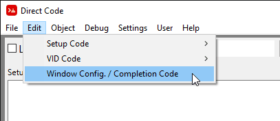
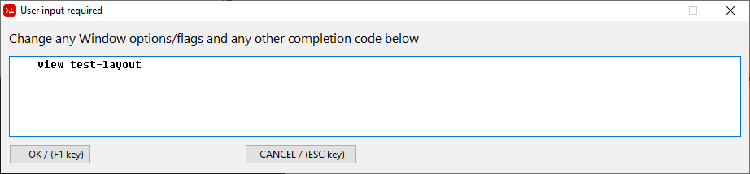
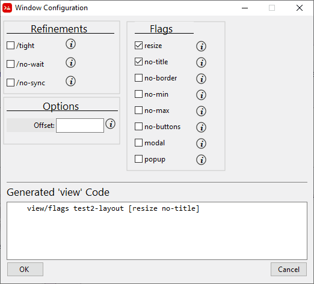

= Window Configuration and Completion Code Editor

The Window and completion Code Editor is accessed the 
Menu: Edit / Window Config. / Completion Code

Once you click on the *Edit Window and Completion Code* button you will be presented with this small code editor:

The most common use cases for this is to modify the view flags or options for the window that is created.

For programs that don't require any GUI output at all, the `view` command can be commented out. If you delete the *view* line completely, Direct Code will regenerate the default view code again. You can put any code in here that you like, even sophisticated generated view layout code, if you do this just be sure to comment out the *view* statement, so that your customizations aren't over written. If you do this then the *Window Configuration* requester won't work properly. (This will be changed in the future) 

The *Window Configuration* button will open a requester looks like this:

Here you can select any customization that you want to make to the window.
Once you press "OK" the code generated will be incorporated into your Direct Code program.

  