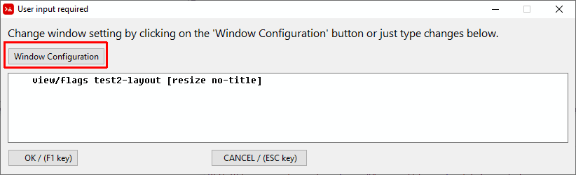

= Window and Completion Code Editor

The Window and completion Code Editor is accessed through the button highlighted below:

image:images/window-completion-code-button.png[]

Once you click on the *Edit Window and Completion Code* button you will be presented with this requester:

What is shown is the default code generated by Direct Code. You can change this to anything you want.

The most common use cases for this is to modify the view flags or options.

For programs that don't require any GUI output the `view` command can be commented out. If you delete this line completely it will revert back to the default code genterated by Direct Code.

